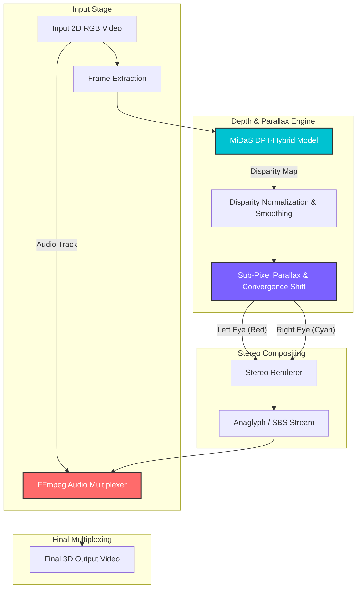

# 🎬 3D-FY — AI-Powered 2D-to-3D Video Converter

> Convert standard flat 2D videos into immersive stereoscopic 3D experiences using monocular depth estimation, sub-pixel parallax remapping, and real-time GPU streaming.

  

  

  

---

## 📌 About the Project

Most of human visual memory and historical cinema exists in flat 2D. Converting 2D media to true stereoscopic 3D has traditionally been a tedious, manual post-production process—requiring VFX teams to manually cut object masks frame-by-frame and paint background extensions.

**3D-FY** was born out of an exploration into computer vision and spatial computing: *Can we infer the 3D geometry of a scene from a single 2D camera lens and synthetically render a second perspective in real time?*

By pairing deep monocular depth estimation with sub-pixel differential warping, **3D-FY** dynamically extracts scene depth and synthesizes Left-Eye and Right-Eye perspectives on the fly. Whether you want to view content through classic Red-Cyan anaglyph glasses or submerge into a VR headset via Side-by-Side (SBS) stereo, this tool bridges flat screens with spatial reality.

---

## ⚡ What It Does

- **Monocular Depth Inference:** Converts any standard RGB video frame into a continuous relative depth map.
- **Stereoscopic Video Synthesis:** Generates real-time **Anaglyph (Red/Cyan)** and **Side-by-Side (SBS)** video streams.
- **Audio Stream Remuxing:** Retains and synchronizes the original audio track into output videos using lossless stream mapping.
- **Interactive UI & Demos:** Fully interactive Web UI built with Gradio, deployed natively on Hugging Face ZeroGPU.

---

## 🧬 How It Works (Architecture & Pipeline)

Synthesizing a realistic 3D perspective from a single image requires understanding depth disparity, parallax shifts, and focal convergence.

🏛️ System Architecture Diagram
This diagram shows how data flows across the system components, GPU environments, processing layers, and user interfaces:

---

## 📤 Output Formats

| Format | Output View | Recommended Hardware / Use Case |
| :--- | :--- | :--- |
| **Anaglyph** | Red / Cyan Composite | Standard screens with classic Red-Cyan 3D glasses |
| **Side-by-Side (SBS)** | Dual Parallel Stream | VR Headsets (Meta Quest, Apple Vision Pro, Google Cardboard) |
| **Depth Map** | Magma Colormap | Spatial debugging, 3D structure visualization |

---

## 🖥️ Try It Yourself

### Option 1: Hugging Face Spaces (Live Web App)
Try the interactive web app directly in your browser without any setup:

👉 **[Launch 3D-FY on Hugging Face Spaces](https://huggingface.co/spaces/Madiy/3D-FY)**

> 📌 **Note on Processing Limits:** > The Hugging Face Space runs on shared **ZeroGPU** infrastructure and caps video generation to **15 seconds** per run to manage time budgets. For longer video processing, use the Kaggle Notebook option below.

### Option 2: Kaggle Notebook (Full Processing & Free GPU)
To process full-length videos or experiment with the pipeline source code:

1. Open the **[3D-FY Kaggle Notebook](https://www.kaggle.com/code/mohiadiy/3d-fy-ai-driven-2d-to-3d-converter/edit)**.
2. Click **Copy & Edit** in the top right corner.
3. Enable GPU Acceleration: `Settings` → `Accelerator` → `GPU T4`.
4. Run the setup cells and update `VIDEO_PATH` with your uploaded video file.
5. Execute all cells to generate and download full-length 3D outputs.

---

## 🛠️ Tech Stack

- **Model Architecture:** MiDaS DPT-Hybrid (Intel ISL)
- **Deep Learning Framework:** PyTorch
- **Computer Vision:** OpenCV, NumPy (Vectorized Grid Operations)
- **Audio/Video Processing:** FFmpeg
- **Web UI & Deployment:** Gradio, Hugging Face ZeroGPU (`spaces`)

---

## 🚀 Limitations & Future Scope

### Current Challenges
- **Occlusion Gaps:** Shifting foreground objects creates minor disocclusion holes along object borders.
- **Complex Geometry:** Transparent surfaces (glass, water) and fast-moving subjects can generate depth noise.

### Future Roadmap
- [ ] **Neural Disocclusion Inpainting:** Integrating depth-aware Fast Fourier Inpainting (LAMA / Edge-aware UNet) to seamlessly fill occlusion gaps instead of relying on boundary extension.
- [ ] **Video-Aware Depth Models:** Upgrading to Video Depth Anything for temporal consistency across long video sequences.
- [ ] **TensorRT / ONNX Optimization:** Exporting model graphs to achieve 60+ FPS real-time processing on edge hardware.

---

## 📄 Research & Publications

This repository forms the practical implementation for an ongoing research paper examining monocular disparity translation and occlusion filling algorithms.

- **Paper Title:** *3D-FY: AI-Based 2D to 3D Video Conversion Using Monocular Depth Estimation*
- **Status:** *Under preparation for IEEE conference submission*

---

## 👤 Author

**Mohit Aditya** *B.Tech in Artificial Intelligence & Machine Learning* JB Institute of Technology, Dehradun  

- 🔗 **LinkedIn:** [Mohit Aditya](https://www.linkedin.com/in/mohit-aditya-55506b255/)
- 💻 **GitHub:** [@Mohit485](https://github.com/Mohit485)
- 📝 **Notion Portfolio:** [Mohit's Workspace](https://app.notion.com/p/Mohit-Aditya-37ed29052bd9801d80adec7e68a77ef4?source=copy_link)

---

## 🙏 Acknowledgements

- [Intel ISL MiDaS](https://github.com/isl-org/MiDaS) for the monocular depth estimation model.
- [Hugging Face](https://huggingface.co/) for ZeroGPU hosting infrastructure.
- [Kaggle](https://www.kaggle.com/) for free GPU hardware access.
